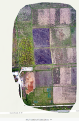

### Important Files
[Pix4D Processing Report](/static/files/14/2021-04-19_report.pdf)

[GCP Actual locations shown](/static/files/14/GCP_Actual_shown.pdf)

[GCP aggregated locations shown](/static/files/14/GCP_Aggregate_shown.pdf)

[Southmost burn plots over three week period](/static/files/14/SMBPOT.pdf)

**Week 14 Field Outing Deliverable**

**Introduction**

The field outing for April 19, 2021, was, I believe, the most crisp imagery we managed to capture. For some reason or another (I&#39;d personally credit Matt&#39;s skillset with mission planning), the images came out looking spectacular with little to no stitching visible once all of the images were compiled. This was also the first outing our group used ArcCollector data effectively and mapped it against the actual GCP data. Interestingly, the GCP coordinates were loosely correlated; just about as consistent as the average of all the data we supplied using ArcCollector across about eight individuals&#39; phones.

**Study Area**

The area the mission was conducted at was the Purdue Wildlife Area – specifically the burn plots, neighboring fields, and construction areas. The image shown is the orthomosaic compiled from the data generated and goes to show the general size of the mission.

_fig. 1: an incredibly crisp orthomosaic generated, shown for size reference (and due to pride of clarity!)_

**Metadata**

| **FLIGHT INFORMATION** |
| --- |
| Location | Purdue Wildlife Area |
| Date | 19 April 2021 |
| Time | 14:45 |
| **WEATHER** |
| METAR Used | KLAF |
| Temperature | ~55degF |
| Precipitation | 1% |
| Winds | 10.45kt |
| **VEHICLE INFORMATION** |
| Vehicle | DJI Mavic Pro 2 |
| Sensor | Ibid |
| Battery Count | 2 |
| **MISSION SPECS** |
| PIC | Matthew Watson |
| VO | Bryan Jacobs |
| Flight Number | 04-19 |
| Takeoff Time: | 14:45 |
| Landing Time: | 14:59 |
| Altitude | 106.7m |
| Sensor Angle | -90deg |
| Overlap | 80% |
| Sidelap | 80% |
| Geolocation System Used | GCP |
| Coordinate System | WGCS 1984 UTM Zone 16 |

_fig. 2: metadata_

**External Deliverables**

Additionally requested were orthomosaics of:

- Actual GCP location shown from above
- Aggregated GCP location shown from ArcCollector
- Orthomosaic of the Southfield showing the three weeks&#39; worth of data compared against one another

These can be found in the **Ortho** subfolder within the .zip folder.

