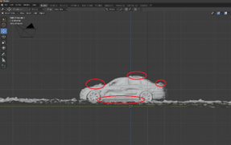
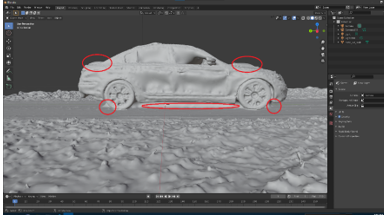

### External Deliverables
[Generated .zip pack](https://drive.google.com/file/d/1u5WpZPgmdr-0gmCWx_H_VREQXFJBI0_i/view?usp=sharing) - this contains the .mp4

# Pix4D 3DModel Project - 2021 04 22 Mission

**Tools**
DJI Mavic Pro 2, Pix4D, Pix4D Cloud, Blender

**Introduction**
The field outing for April 22, 2021, was conducted to aggregate data to generate a 3D Model of a designated item. For the sake of the project and running into a few barriers for prospective ideas, I wound up conducting this mission using my car as the model. I intended to capture the known physical deformities it has (e.g. missing door handle, busted bumper) in order to see how accurate a 3D Model could turn out using a DJI Mavic Pro 2. Due to the nature of my studies and the iterative development of the UAS program, this was my first ever flight, and I was grateful for the opportunity to have Cole Bramel as my VO.

**Flight**
I initially intended on capturing a full 360-degree rotation of the car using 45-degree angles and stitching them together with Pix4D, though I ended up capturing upwards of 110 images in the sake of being thorough and rather safe than sorry. Cole informed me the app would automatically take information around the location captured within the project, which calmed my nerves.

**Processing**
I processed the images four times. The first two were using the native Pix4D software within our airport&#39;s lab. I found that the software took a significant tax on the machine I used, leading to increased processing time, so I sought an alternative. Fortunately, Pix4D has a cloud-based suite open for use by subscribing individuals.

Using Pix4DCloud, I was able to lean-generate a 3DM in .fbx format, and I was surprised to see the results – there was blending!

_Fig. 01: blending spots pointed out pre-iteration_

Seeing how this could act as an inconvenience should anyone desire to use a model or follow suit and generate a 3DM of their own car, I took to Blender to resolve the discrepancies within the model. Fortunately, the point cloud and generated texture were well-aligned as an .fbx file, so sculpting the model was relatively straightforward. The end sculpt turned out quite nice and is displayed without the texture color to match the initial edit and display the differences.

_fig.02: Blending spots pointed out post-iteration, (and areas of concern for future reference i.e. the tires)_

**Study Area**
The mission was conducted at the back-end of Martell Forest. The mission itself was filed with Martell using the Qualtrics form and spanned approximately 40m by 40m, with a maximum altitude of approximately 8m. Post-render showed a robust polygon-shaped area. The model itself was processed along with roughly 50% overlap to take in surroundings; one can barely make a figure standing in the .fbx (can be viewed using 3DModel on Windows machines; no need to open in P4D) models throughout iteration.

**Metadata**
The metadata pertaining to the 3D-M Mission is as follows.

| **FLIGHT INFORMATION** |
| --- |
| Location | Martell Forest |
| Date | 22 April 2021 |
| Time | 12:37 |
| **WEATHER** |
| METAR Used | KLAF |
| Temperature | 48degF |
| Precipitation | 0%% |
| Winds | 12kt Gusting, West |
| **VEHICLE INFORMATION** |
| Vehicle | DJI Mavic Pro 2 |
| Sensor | Ibid |
| Battery Count | 2 |
| **MISSION SPECS** |
| PIC | Bryan Jacobs |
| VO | Cole Bramel |
| Flight Number | 4 22 #2 |
| Takeoff Time: | 1237 |
| Landing Time: | 1259 |
| Altitude | 8m |
| Sensor Angle | -90deg; variant |
| Overlap | 80% |
| Sidelap | 80% |
| Coordinate System | WGCS 1984 UTM Zone 16 |

_fig. 3: Metadata_
