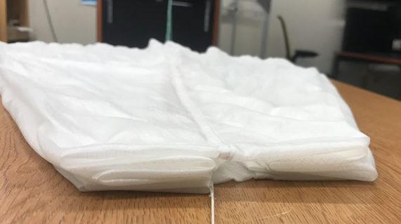

Parachute Folding and Bramor PPX components

There are two Pelican-style cases for 
The 9 numbered items found when opening the top case are as follows:
1.	Batteries 
2.	Spare cables and weather station specific to platform
3.	Extra propellors 
4.	Two packed parachutes
5.	GTech GCS Tablet
6.	Camera Lens for RX-1R RGB Sensor
7.	GCS Relay
8.	Camera lens wipes
9.	Utility section w/ wing tape, 193hex, and sensor directions
10.	 There is also the body of the Bramor.

The wings can be found in the wing tab; pull down on the two slits on the inner tab, and there are the wings + wing tips.

The wing spars are located below the Bramor's body. I
o	How do you get to the items in the Bottom Case?
▪	You need to detach it from the top case. It is recommended to ensure latches are locked before detaching.
o	What items are located in the Bottom Case?
Folded up catapult, consisting of:
1.	Elastic bungees
2.	Legplate
3.	Middle lock
4.	Catapult rail
5.	Trolley
6.	Crankshaft
7.	Brake line

Part 2: Parachute Folding Videos and Instructions
Learning how to properly fold the parachute is both the most difficult and most important part of training on the Bramor. Later on you will learn how to install the chute into the aircraft, but we will start with learning the parts of the chute, and how to fold it.
●	Watch the Bramor PPX Tutorial 8 on parachute components
o	What are the 11 main components of the Bramor Parachute
1.	Deployment bag
2.	Deployment bag line
3.	Air vent
4.	Canopy
5.	Gores
a.	8x; need to be folded properly
6.	Centerline
7.	8 Suspension lines
8.	Break
9.	Break line
10.	 Main parachute cord
11.	 Attachment loop

	There are eight suspension lines, connected to eight gores. The fores need to be folded properly; after looking it up, they are sectors of curved segments that comprise of a parachute. 
o	Before folding the parachute, one should you make sure:
▪	The chute has no tears and damage, as that means the parachute is not safe to use. Damaged parachutes must be changed with a new parachute. 
▪	The parachute was freshly folded before use, as they have a chance of getting wet and sticky if stored while folded, which would prevent the parachute from opening.
▪	 Also ensure that the parachute is not tangled.

 
### Bramor Chute Folding Tutorial
1.	Review notices. 
a.	Ensure the parachute has been aired and untangled properly. 

_1-a: image of the chute hanging before taking down to be worked on - it is imperative to ensure that the chute has had ample time to air out._
b.	Ensure the break line can move freely up and down the lines.  

_1-b: figures 1-b.1 & 2 demonstrate effectively moving the brake along the lines. It is key to ensure the brake can move._
c.	The mentioned procedure is followed carefully and step by step. This is the only approved procedure when folding a Bramor UAS parachute. If you are not 100% certain of your actions, you do not qualify to pack the parachute. This is something that is necessary to know when flying the unmanned system.
d.	This process should be followed meticulously and with extreme care.
2.	Familiarize yourself with the parachute guide.
a.	Know the 11 primary components 

Figure 2. Parachute and its components 
3.	Inspect the parachute
a.	Make sure to check for any tears and damages, as that means the parachute is not safe to use. Damaged parachutes must be changed with a new parachute. 
b.	Make sure the parachute was freshly folded before use, as they have a chance of getting wet and sticky if stored while folded, which would prevent the parachute from opening.
c.	 Also ensure that the parachute is not tangled.
 
Fig 3 - Parachute set out on table - to be inspected to ensure it is not tangled.
4.	Folding process
a.	Place the parachute on a flat surface and extend the canopy. 
a-i.	Group suspension lines together; tape down the extended strings.    

Fig. 4-6: the strings taped down on the table to flip through the gores

b.	Gores are separated by suspension line attachment points.
c.	Fold gores on one side.
d.	Divide gores by four on each side.
e.	Place a weight below the top of the canopy at ⅓ the canopy length.
f.	Pull the main parachute cord until all the suspension lines become tight.
f-i.	Ensure the parachute brake has freedom of movement and is not tangled with main or suspension lines. 
f-ii.	Failure will result in loss of theunmanned system due to improper parachute preparation.
f-iii.	There are two lines (the brake line and center line) in the middle and four suspension lines on each side of the canopy.
f-iv.	Check the suspension lines for tangling near the canopy. The suspension lines MUST BE PARALLEL without any obstructions towards the canopy. This kind of tangling will not open the canopy at all and WILL RESULT IN FAILED DEPLOYMENT.
g.	Align the folds at the top of the canopy.  

Fig. 7: Aligning the folds at the canopy

h.	The folds should have a zigzag pattern as seen from the top.
i.	Realign the chute to have four folds on each side.
j.	Hold the top and the bottom of the half-folded canopy and rotate it on the other side. Be careful to take hold of the canopy approximately 5cm over the canopy’s center line.
j-i.	This must be a zigzag fold
j-ii.	Measure 9-10cm on hand, then fold the parachute with about 5cm on either side of the center line.
j-iii.	Ensure the line is straight so it will fit in the deployment bag.
k.	Flip the chute over before starting on the other side.
l.	Fold vertically in a zig-zag pattern. The length of each fold should be approximately 10cm.\ 

Figure 8: Post zig-zag folds, ready to be placed in the parachute deployment bag.

m.	Tighten the suspension lines. Place the chute, STRINGS UP, on the deployment bag.
i.	Suspension lines must be even. The brake will be placed on top before folding the parachute bag.
n.	Fold starting with the West ear, then the East ear, then the South ear, and lastly the North ear. 
5.	Fitting, Threading Process
a.	Take the tool and feed the strings through.
a-i.	Ensure the parachute fits cleanly in the deployment bag.
b.	Use the tool to feed strings through the parachute bag.
b-i.	Ensure no edges or knots.
b-ii.	Suspension lines should be of equal length.
b-iii.	Red suspension line should be in the middle at this point 

Figure 9: First attempt folded; to be revised and rethreaded!
6.	Documenting Process 
i.	Write on a piece of tape the name of who packed it, the date and time at which it was packed.
  
Figure 10: Writing on tape and placing it on the bag.

ii.	Place the tape on the bag after. DO NOT WRITE ON THE BAG.
 
Finally, don’t forget about providing recording of the assessment information.
1.	Prior to this activity, how would you rank yourself in knowledge about the topic. (1-No Knowledge at all, 2-Very Little Knowledge, 3-Some knowledge, 4-A good amount of knowledge, 5-I knew all about this)
2.	Following this activity, how would you rate the amount of knowledge you have on the topic (1- I don’t really know enough to talk about the topic, 2- I know enough to explain what I did, 3-I know enough to repeat what I did, 4-I know enough to teach someone else, 5- I am an expert)
3.	Did the hands-on approach to this activity add to how much you were able to learn (1-Strongly Disagree, 2-Disagree, 3-No real opinion, 4-Agree, 5-Strongly Agree)
4.	What types of learning strategies would you recommend to make the activity even better?

1.	I would say I had no knowledge on this topic whatsoever. Fortunately the resources I had used to effectively understand how to fold a parachute specifically for the Bramor proved to be insightful, placing:
2.	at a higher level - I’d say I know enough to walk someone else through folding their own parachute, given the amount of times I re-did the steps to make sure they were done properly. 
3.	The hands-on approach was imperative. I can sit down, read, and ingest the gist of anything, but it requires my actually folding a parachute per say to understand the nuances and why steps are the way steps are.
4.	I would continue compiling walkthrough steps to afford the students useful content to reference and build their knowledge from.

 

