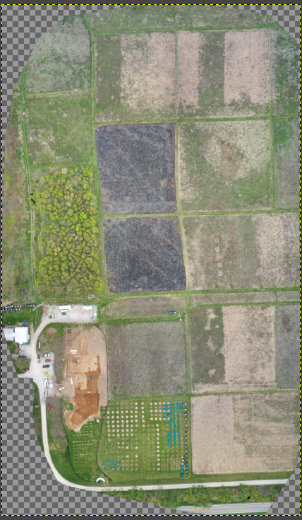

# ESRI's ArcGIS Pro: an unmanned aviator's reference guide
### Useful Links
[Getting Started with ArcGIS Pro](https://www.esri.com/training/catalog/57630435851d31e02a43f007/getting-started-with-arcgis-pro/) _by ESRI_
[The Difference between DEM and DSM](https://menetaero.com/blog/drone-data-outputs) _by MenetAero_
[Geoprocessing Tool Reference Guide](https://pro.arcgis.com/en/pro-app/latest/tool-reference/main/arcgis-pro-tool-reference.htm) _by Esri_

[Metadata Template](static/files/metadata.docx)

### Objectives
  The objective of this article is to inform the reader of basic cartographic skills and how a little bit of domain knowledge can borders the difference between making and missing a GIS project.

### Overview
So you've conducted your mission and processed it using Pix4D (or a service not unlike it). What do you do with the processed data? Chances are, the person expecting professional deliverables won't be happy if you pass along a .tiff file and call it done. You're likely going to run through post-processing procedures, i.e. cleaning it up and making it friendly for individuals to reference in a non-frustrating manner. If you were hired to compile the data, chances are expectations are for you to bite the bullet and drop another hour or so worth of time into getting it in ship-shape for presentation.

### Fundamentals
Your generated file likely came out in two foramts: an _orthomosaic_ or a _dsm_ (or _digital surface model_). Depending on what you're doing, you'll use one or the other. For the sake of this post, let's assume you're working with an orthomosaic, as you've been hired to stitch together some burn plots. Maybe your data came out like this:

  
_fig. 01: Orthomosaic of a burn plot_

If this is the case, nice job on collecting the data (and ideally with that [metadata](/cart-fund)).

Say you're gathering data relevant to the location of specific objects, and the information needs to be as accurate as possible. When you're using your .tiff, be sure to enable _pyramids_ to ensure data visualization and statistics calculations stretch accordingly. 

Generating pyramids, gathering  visualizations, and statistics calculations are mighty important for whether or not you're working with a DSM or an ortho; this is due to the fact that proper data aggregation makes for a proper outcome. Knowing the units and cell size directly impact how useful the data is, and depending on the use of the dataset, so do the elevations. Projection is important to have a well-rounded cartographic understanding of the area.

Say your job is to focus on elevation. You're likely going to want to understand the difference between DSM and DEM, which [Peter Menet of MenetAero did a phenomenal job explaining in this article](https://menetaero.com/blog/drone-data-outputs). 

Say you're working with a DSM. You're likely going to want to generate hillshading to accurately depict heights of hills and slopes from a top-down perspective.

### Additional Information
This assignment was written following [Dr. Joseph Hupy's](https://polytechnic.purdue.edu/profile/jhupy) guidance and acts as half of a deliverable for a Cartographic Fundamentals as well as a Volumetrics assignment. 