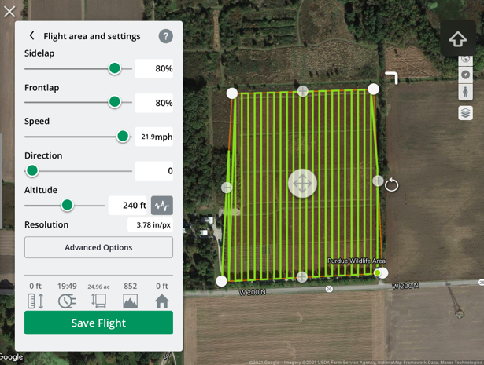
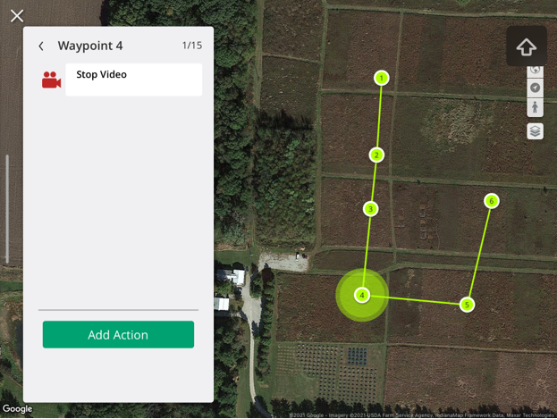

# Measure Ground Control: Mission Ettiquette
### Important Links
[Measure Ground Control's](https://www.measure.com/fly-for-free?utm_term=measure%20ground%20control&utm_campaign=Drone+Software&utm_source=adwords&utm_medium=ppc&hsa_acc=2525572526&hsa_cam=9790299837&hsa_grp=102549925889&hsa_ad=492838608639&hsa_src=g&hsa_tgt=kwd-896610544756&hsa_kw=measure%20ground%20control&hsa_mt=e&hsa_net=adwords&hsa_ver=3&gclid=Cj0KCQjw-LOEBhDCARIsABrC0TnUNdoDKIwbLuDClTeMueF5GFcjPgDSvA7BKGbcS4QMYBG9lDiMxHoaAl-rEALw_wcB) application

[Measure's article on Waypoint Flights](https://www.measure.com/help/autonomous-flight-with-waypoint)

[Measure's article on Grid Flights](https://www.measure.com/en/help/mobile-grid-flight)

### How to use MGC to connect your phone and start or createa mapping mission

1. Tools
   1. MGC
   2. Telemetry?GPS?etc
2. Boot MGC
3. Enable platform
4. Establish connection
5. Create mission 
6. Lost links/emergency/pre-planning procedure


### Know your Area
It's important to knwo if you're in a place you can fly. Take note of what airspace you're flying in. For example, Martell Forest (figure 1) and Purdue Wildlife (2) are not in restricted airspace. Martell forest appears to be on the outside of Class D airspace border, whereas Purdue Wildlife appears to be within Class D airspace.

_fig.1: Martell Forest_


_fig.2: PWA_

In areas such as McCormick Woods, however, one needs to request flight authoroization to fly, seeing how it is within class D Airspace.

_fig.3: McCormick Woods_

Take note of the "Request permission" button in the bottom right; this can be an arduous process. Fortuantely for those inclined to use it, Measure Ground Control is connected to LAANC via the AirMap app. This is an important connection for commercial operations because LAANC allows pilots to receive automatic approval to fly in certain restricted areas by checking requests and approvals in real-time. Measure describes it as:

```
 “LAANC is short for Low Altitude Authorization and Notification Capability, an FAA program run in collaboration with approved UAS Service Suppliers (USS). LAANC provides access to controlled airspace near airports below approved altitudes in real-time via USS-developed interfaces. LAANC checks airspace authorization requests against a number of airspace data sources in the FAA UAS Data Exchange (TFRs, NOTAMs, etc.), automatically returning authorizations where permitted.”
```

Provided the mission is below the 200ft mark, this can and will enable mission plans to be created and submitted in less time as less time, since LAANC automates the approval process for missions under 200'. This is advantageous for people who set up mission plans with little lead time to the actual mission.

Figures 4-7 show what a general flight plan establishment looks like.

_fig.4-7: Flight plan setup_


The ability to do all of this in-house/in one platform provides the advantage of localizing all of the things that need to be checked, set, and calibrated. It lessens the opportunity for human error. Establhing an in-tandem checklist for flight planning provides the adantage of ensuring gimbal, IMU, and compass calibration are imperative to safety and efficiency; if the compass/IMU aren’t calibrated, the safety is compromised as the flight may not be on the exact course or at the exact speed the PIC assumes. If the gimbal is not calibrated, the mission’s efficiency could be compromised as the payload could not be performing what it needs to be performing (e.g. pointing a camera the wrong way).

#### Pages
Fly:	This is where manual flight operations are conducted from. One might use this screen to manually validate sensor settings and access storage by going through the Imagery Menu. It has everything that may need to be routinely assessed all in one screen. This aids flight operation safety and efficiency.

Flight Plan: This is helpful when referencing or reviewing a specific mission, flight plan, or area. 
[Measure's article on Waypoint Flights](https://www.measure.com/help/autonomous-flight-with-waypoint)
[Measure's article on Grid Flights](https://www.measure.com/en/help/mobile-grid-flight)

The following figures establish waht setting up a mission might look like with varying grid-flight settings:





_fig 8-15: Varying settings for MGC Grid Flights_


The following figures establish waht setting up a mission might look like with varying waypoint-flight settings:





_fig 15-22: Varying settings for MGC Waypoint Flights_


Hopefully this gives you a general overview of [Measure Ground Control's](https://www.measure.com/fly-for-free?utm_term=measure%20ground%20control&utm_campaign=Drone+Software&utm_source=adwords&utm_medium=ppc&hsa_acc=2525572526&hsa_cam=9790299837&hsa_grp=102549925889&hsa_ad=492838608639&hsa_src=g&hsa_tgt=kwd-896610544756&hsa_kw=measure%20ground%20control&hsa_mt=e&hsa_net=adwords&hsa_ver=3&gclid=Cj0KCQjw-LOEBhDCARIsABrC0TnUNdoDKIwbLuDClTeMueF5GFcjPgDSvA7BKGbcS4QMYBG9lDiMxHoaAl-rEALw_wcB) application!